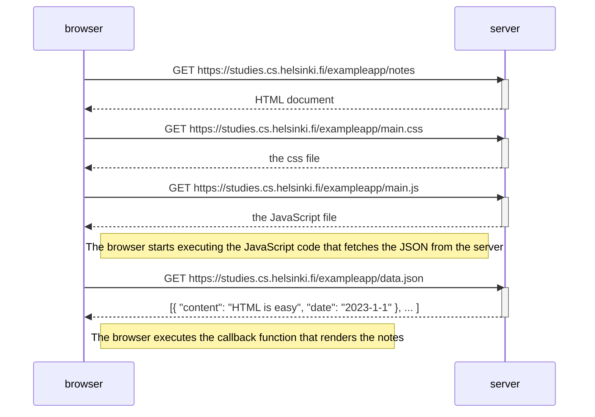
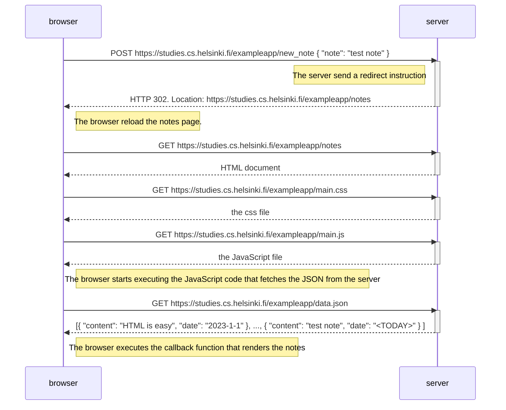
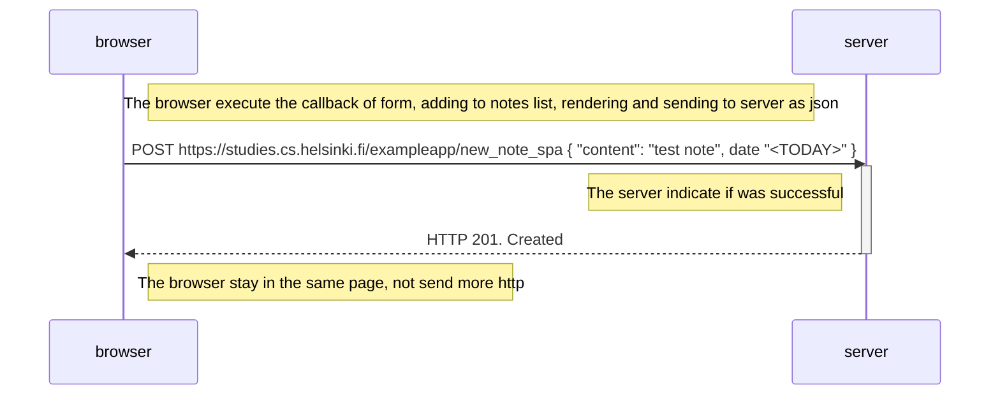

# Diagrama de eventos:

## Al abrir https://studies.cs.helsinki.fi/exampleapp/notes

## Al crear una nota en https://studies.cs.helsinki.fi/exampleapp/notes

## Al abrir https://studies.cs.helsinki.fi/exampleapp/spa

## Al crear una nota en https://studies.cs.helsinki.fi/exampleapp/spa

